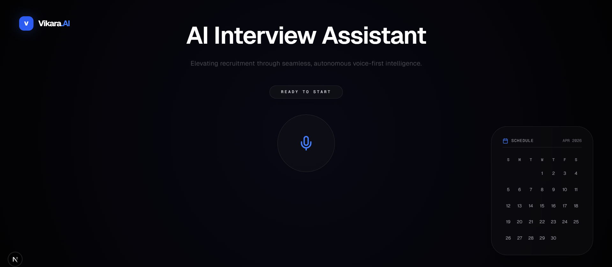
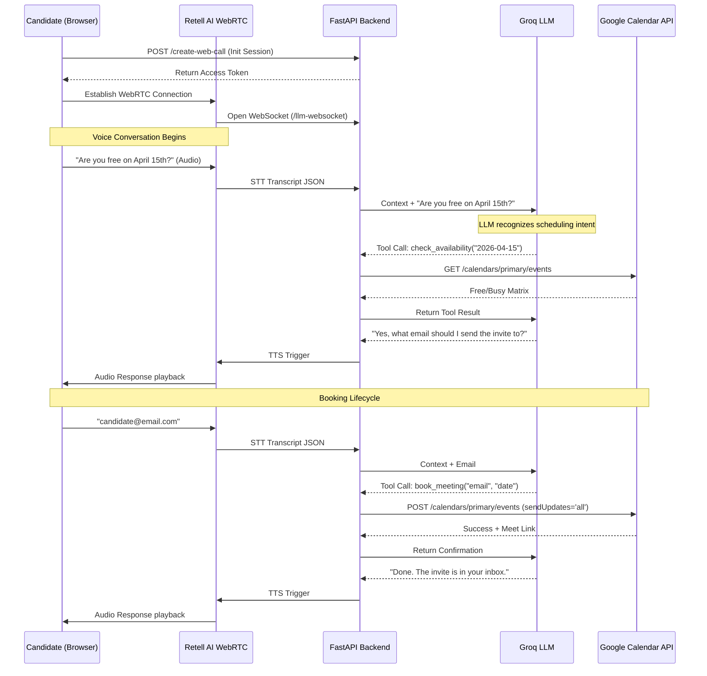

# 🎙️ Vikara.AI | Autonomous Voice Recruiting Intelligence


> **Vikara.AI** is an enterprise-grade autonomous Voice AI platform designed to revolutionize the technical screening process. It conducts ultra-low latency voice interviews, assesses candidate responses, dynamically checks recruiter availability, and autonomously schedules Google Meet interviews directly into the calendar.

---

## 📸 Platform Interface

<div align="center">
  <a href="docs/interface.png">
    
  </a>
</div>

---

## 🚀 Live Deployments
* **Frontend Application (Vercel):** [`https://vikara-ai.vercel.app`](#) *(Enter your link)*
* **Backend API (Render/Railway):** [`https://vikara-api.onrender.com`](#) *(Enter your link)*

---

## ✨ Advanced Core Features

### 1. Ultra-Low Latency Conversational AI
* **Sub-500ms Response Time:** Powered by the Groq LPU inference engine and LLaMA-3.1-8b-instant, achieving real-time human-like dialogue.
* **Full Duplex Audio:** Utilizing the Retell AI WebSocket infrastructure, the agent handles interruptions, backchanneling, and emotional prosody natively.

### 2. Autonomous Scheduling Engine
* **Dynamic Availability Matrix:** Real-time checking of Google Calendar slots via OAuth 2.0.
* **Zero-Touch Booking:** Autonomously schedules events, generates secure Google Meet video conferencing links, and dispatches calendar invites directly to the candidate's inbox.
* **Mutation Capabilities:** Full support for rescheduling or canceling existing events based on natural language requests.

### 3. High-Performance GPU-Accelerated Client
* **Cinematic UI/UX:** Built with Framer Motion utilizing hardware-accelerated (`willChange: transform`) animations for 60FPS flawless rendering without layout thrashing.
* **State Management:** Complex React hooks manage real-time transcript streaming, agent state mapping (Listening vs. Speaking), and dynamic UI rendering.

---

## 🏗️ Technical Architecture & Topologies

### Core Tech Stack
| Layer | Technology | Purpose |
| :--- | :--- | :--- |
| **Frontend** | Next.js 14, TailwindCSS, Framer Motion | SSR, Hardware-accelerated UI, State Management |
| **Backend** | Python, FastAPI, Uvicorn | High-throughput asynchronous REST/WebSocket API |
| **LLM Engine** | Groq (LLaMA-3.1-8b) | NLP, Intent Recognition, Tool/Function Calling |
| **Voice Engine** | Retell AI | Speech-to-Text (STT), Text-to-Speech (TTS), WebRTC |
| **Integrations** | Google Calendar API v3 | OAuth2 Calendar management, Meet link generation |

### Chronological System Sequence Diagram

The following diagram illustrates the chronological data flow of a single interview session:



## ⚙️ Chronological Setup & Initialization Guide

To deploy this ecosystem locally, strict adherence to the following sequence is required. The system is bifurcated into a Python-based AI orchestration layer and a React-based client layer.

### 🛡️ Phase 1: Prerequisites & Environment Secrets
Before cloning the repository, secure the necessary API keys and OAuth credentials.

1. **Groq API Key:** Provision an API key from the [Groq Cloud Console](https://console.groq.com) for LLaMA-3 inference.
2. **Retell AI Agent:** Navigate to [Retell AI](https://retellai.com), instantiate a new Voice Agent, and secure the `Agent ID` and `API Key`.
3. **Google Cloud Platform (GCP) OAuth:**
   * Access the GCP Console and enable the **Google Calendar API**.
   * Provision an **OAuth 2.0 Client ID** (Type: Desktop Application).
   * Download the secret file as `credentials.json` and place it securely in the `/backend` directory.

> **⚠️ SECURITY NOTICE:** Never commit `credentials.json`, `token.json`, or `.env` files to version control. Ensure they are listed in your `.gitignore`.

---

### 🧠 Phase 2: Backend Initialization (FastAPI Core)
The backend acts as the secure bridge between Retell's WebRTC engine, Groq's LLM, and Google's OAuth-protected APIs.

```bash
# 1. Clone the repository and navigate to the backend
git clone [https://github.com/yourusername/vikara-ai.git](https://github.com/yourusername/vikara-ai.git)
cd vikara-ai/backend

# 2. Instantiate and activate a Python virtual environment
python3 -m venv venv
source venv/bin/activate  # On Windows: venv\Scripts\activate

# 3. Install required dependencies
pip install -r requirements.txt

# 4. Provision Environment Variables
cat <<EOT >> .env
GROQ_API_KEY=your_groq_api_key_here
RETELL_API_KEY=your_retell_api_key_here
EOT

# 5. Initialize the ASGI Server
uvicorn main:app --reload --port 8000
```

### 🖥️ Phase 3: Frontend Initialization (Next.js Client)
The client handles hardware-accelerated rendering, browser microphone permissions, and WebSocket state management.

```Bash
# 1. Open a concurrent terminal session and navigate to the client
cd vikara-ai/frontend

# 2. Install Node dependencies
npm install

# 3. Inject Retell Agent Configuration
# Open app/page.tsx and replace `YOUR_RETELL_AGENT_ID` on Line 25 with your provisioned Agent ID.

# 4. Launch the Development Server
npm run dev
Navigate to http://localhost:3000. The UI will compile, but requires active WebRTC tunneling to establish voice connectivity.
```

## 📂 Project Architecture Matrix
```Bash

vikara-ai/
├── frontend/                     # Next.js 14 Client Ecosystem
│   ├── app/
│   │   ├── layout.tsx            # Root DOM & Metadata definitions
│   │   ├── page.tsx              # Retell SDK implementation & GPU UI
│   │   └── globals.css           # Tailwind JIT Utility Directives
│   ├── public/                   # Static CDN assets
│   └── package.json              # Node dependency manifest
│
└── backend/                      # Python/FastAPI Microservice
    ├── main.py                   # REST routing & WebRTC state manager
    ├── llm.py                    # Groq System Prompts & Tool Orchestration
    ├── calendar_tools.py         # GCP OAuth & Calendar CRUD mutations
    ├── rag_tools.py              # Extensible Knowledge Base integration
    ├── credentials.json          # 🔒 GCP OAuth Client Secrets (Untracked)
    ├── token.json                # 🔒 GCP Refresh Tokens (Untracked)
    ├── .env                      # 🔒 API Keys (Untracked)
    └── requirements.txt          # Production package freeze

```
Developed by Keshav Sharma | AI Engineer